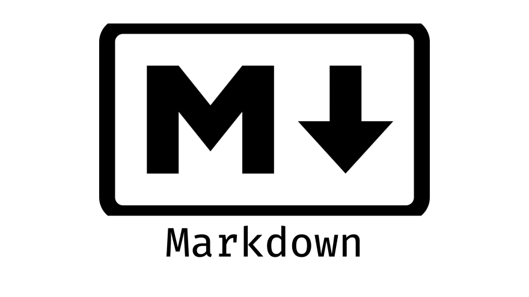

# Aplicacion-Diseno-Web

**Nombre del alumno:** Samuel Rafael Rojano Herrera  
**Matrícula:** 2679928  
**Carrera:** Ingeniería en Desarrollo de Software  
**Semestre:** 6.º Semestre  

---

**Nombre del curso:** Diseño de Aplicaciones Web

---

**Nombre del Profesor:** Cristopher Gerardo Gaytán Díaz




## Acerca de Markdown

MarkDown ofrece las siguientes opciones de etiquetado:

## Encabezados

-- # Encabezado 1
-- ## Encabezado 2
-- ### Encabezado 3

## Texto en negrita y cursiva

-- **Texto en negrita**
-- *Texto en cursiva*


-- ## Listas: Pueden ser numeradas o con viñetas

-- 1. Elemento 1
-- 2. Elemento 2

-- - Viñeta 1
-- - Viñeta 2


## Enlaces: Se crean con [texto](URL).

[//]: # ([Enlace a Google](https://www.google.com))


## Imágenes: Similar a los enlaces, pero con ! al principio.

[//]: # ()


## Citas: Se utilizan con el símbolo >

-- > Esto es una cita.

## Código en línea y bloques de código: Se puede usar ` para código en línea y el triple ``` para bloques de código

-- `Código en línea`

-- ```python
-- Bloque de código


## Líneas horizontales: Se pueden crear con 3 o mas guiones (---) o asteriscos (***)

[//]: # (-- ---)

## Tablas: Se pueden crear con barras verticales | y guiones -

[//]: # (-- | Encabezado 1 | Encabezado 2 |
-- | ------------ | ------------ |
-- | Celda 1      | Celda 2      |)
